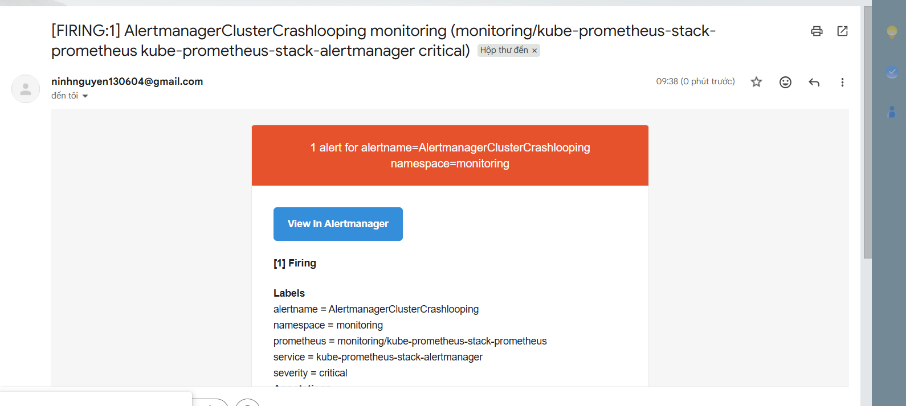
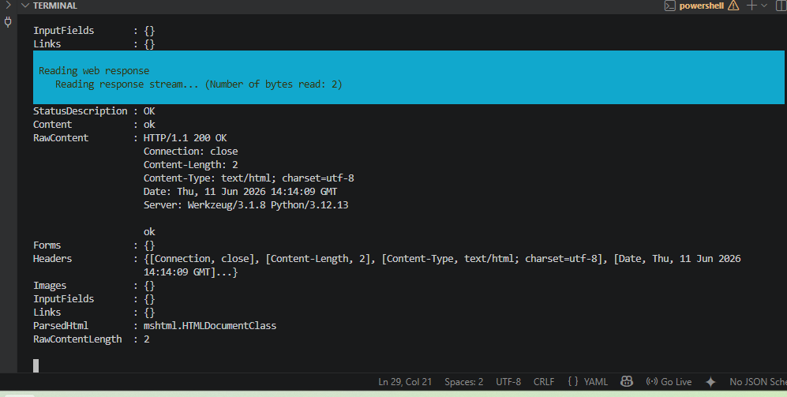
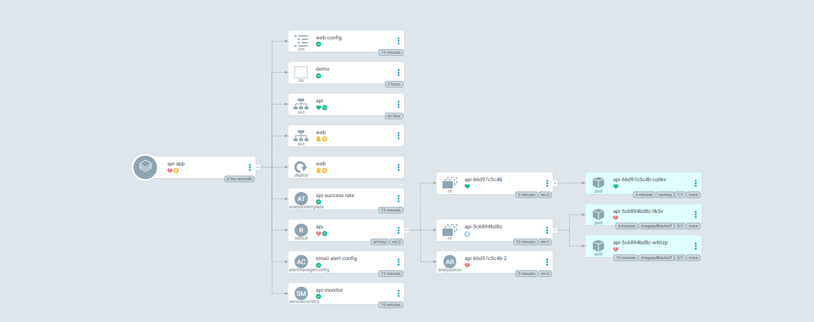

# Báo Cáo Hướng Dẫn Lab GitOps Với ArgoCD, Prometheus Và Argo Rollouts

## Mục tiêu tổng quát
Bài lab này hướng dẫn xây dựng và vận hành một hệ thống phân phối phần mềm hiện đại (Modern Delivery Pipeline) trên Kubernetes local (Minikube). Hệ thống ứng dụng triệt để mô hình GitOps làm nền tảng, mở rộng sang giám sát tự động (Observability) và triển khai an toàn bằng chiến lược Canary kết hợp hệ thống cảnh báo tự động gửi Email về hòm thư cá nhân khi vi phạm cam kết chất lượng dịch vụ (SLO).

Nội dung báo cáo được chia làm 3 giai đoạn thực chiến:
1. **LAB SÁNG: GitOps Cơ Bản Với ArgoCD** (Thiết lập gốc, Quản lý trạng thái mong muốn qua Git).
2. **LAB CHIỀU: Progressive Delivery Với Prometheus Và Argo Rollouts** (Thu thập metric và Canary thủ công).
3. **BÀI CHALLENGE NÂNG CAO: Tự Động Đánh Giá SLO & Tích Hợp Hệ Thống Alertmanager Fire Email** (Kích nổ bom lỗi, Tự động hóa Rollback, Định tuyến SMTP gửi Mail qua Google App Password).

---

# PHẦN 1: LAB SÁNG - GITOPS CƠ BẢN VỚI ARGOCD

## 1. Nguyên lý GitOps chứng minh qua bài Lab
Bài lab chứng minh một nguyên lý cốt lõi: **Git là nguồn sự thật duy nhất (Single Source of Truth) của toàn bộ hệ thống.**

- Thay vì sử dụng lệnh deploy truyền thống dễ gây trôi lệch cấu hình do sửa tay (Configuration Drift): `kubectl apply -f deployment.yaml`
- Mô hình GitOps thiết lập thế kiềng ba chân vững chắc:
  - **Git Repo** = Trạng thái mong muốn (Desired state).
  - **Kubernetes Cluster** = Trạng thái thực tế (Live state).
  - **ArgoCD Controller** = Đóng vai trò là người giám sát, liên tục đối chiếu Git với Cluster nhằm thực hiện đồng bộ tự động (Auto-sync) hoặc tự chữa lành (Self-heal).

## 2. Cấu trúc thư mục Repo GitOps (Giai đoạn 1)

```text
GITOPS/
├─ .github/
│  └─ workflows/
│     └─ validate.yaml
├─ argocd/
│  ├─ root.yaml
│  └─ apps/
│     └─ web.yaml
└─ k8s/
   ├─ namespace.yaml
   └─ web.yaml
```

## 3. Các bước triển khai chi tiết

### Bước 1: Khởi tạo hạ tầng ArgoCD nền tảng

Tiến hành tạo không gian tên biệt lập và áp dụng manifest cài đặt ArgoCD:

```powershell
kubectl create namespace argocd
kubectl apply -n argocd --server-side --force-conflicts -f https://raw.githubusercontent.com/argoproj/argo-cd/stable/manifests/install.yaml
```

### Bước 2: Khai báo ứng dụng Web Nginx (`k8s/web.yaml`)

```yaml
apiVersion: apps/v1
kind: Deployment
metadata:
  name: web
  namespace: demo
spec:
  replicas: 2
  selector:
    matchLabels:
      app: web
  template:
    metadata:
      labels:
        app: web
    spec:
      containers:
        - name: web
          image: nginx:1.27
          ports:
            - containerPort: 80
```

### Bước 3: Triển khai mô hình quản lý tập trung App-of-apps

Tạo Application con (`argocd/apps/web.yaml`) trỏ về thư mục chứa manifest ứng dụng, sau đó tạo Root Application (`argocd/root.yaml`) để quản lý toàn bộ thư mục `apps/`.

```yaml
apiVersion: argoproj.io/v1alpha1
kind: Application
metadata:
  name: root
  namespace: argocd
spec:
  project: default
  source:
    repoURL: https://github.com/ninhnguyen1003/gitops.git
    targetRevision: HEAD
    path: argocd/apps
  destination:
    server: https://kubernetes.default.svc
    namespace: argocd
  syncPolicy:
    automated:
      prune: true
      selfHeal: true
```

*Chạy lệnh kích hoạt tay một lần duy nhất:* `kubectl apply -f argocd/root.yaml`. Từ giây phút này, mọi ứng dụng con chỉ cần thả file cấu hình vào thư mục `apps/` và push Git, Root App sẽ tự động nhận diện và deploy.

### Bước 4: Kiểm chứng cơ chế tự chữa lành (Self-heal) và Rollback bằng Git

**Kiểm tra Self-heal:** Cố tình phá vỡ cấu hình cluster bằng cách sửa tay số lượng Pod tăng lên 9:

```powershell
kubectl -n demo scale deploy/web --replicas=9
```

Ngay lập tức, ArgoCD phát hiện sự trôi lệch so với Git, kích hoạt Self-heal và cưỡng bức kéo số lượng Pod giảm về đúng số lượng 2 Pod như Git quy định.

**Kiểm tra Rollback:** Thực hiện đảo ngược trạng thái trên Git thông qua lệnh:

```powershell
git revert HEAD --no-edit
git push origin main
```

ArgoCD tự động nạp commit revert và đồng bộ cluster về trạng thái an toàn cũ một cách mượt mà.

### Bước 5: Tích hợp CI kiểm tra cú pháp tự động (GitHub Actions)

Khai báo workflow `.github/workflows/validate.yaml` sử dụng công cụ `kubeconform` để kiểm tra tính hợp lệ của toàn bộ file YAML trong thư mục `k8s/` trước khi cho phép merge code vào nhánh `main`.

---

# PHẦN 2: LAB CHIỀU - PROGRESSIVE DELIVERY VỚI PROMETHEUS VÀ ARGO ROLLOUTS

## 1. Cấu trúc thư mục Repo GitOps mở rộng (Tích hợp App API)

Cấu trúc thư mục được nâng cấp để tích hợp mã nguồn ứng dụng Flask và các tệp tin cấu hình mở rộng:

```text
GITOPS/
├─ .github/workflows/validate.yaml
├─ app/
│  ├─ app.py
│  └─ Dockerfile
├─ argocd/
│  ├─ root.yaml
│  └─ apps/
│     ├─ api-app.yaml
│     ├─ argo-rollouts.yaml
│     ├─ kube-prometheus-stack.yaml
│     └─ web.yaml
└─ k8s/
   ├─ alert-config.yaml
   ├─ analysis.yaml
   ├─ api.yaml
   ├─ namespace.yaml
   ├─ prometheusrule.yaml
   ├─ servicemonitor.yaml
   └─ web.yaml
```

## 2. Các bước triển khai chi tiết

### Bước 1: Viết ứng dụng Flask có hỗ trợ xuất Metric (`app/app.py`)

Ứng dụng sử dụng thư viện `prometheus-flask-exporter` mở cổng `/metrics` thu thập dữ liệu HTTP request, đồng thời nhận biến môi trường `ERROR_RATE` phục vụ kịch bản inject lỗi.

```python
import os
import random
from flask import Flask, jsonify
from prometheus_flask_exporter import PrometheusMetrics

app = Flask(__name__)
PrometheusMetrics(app)

ERR = float(os.getenv("ERROR_RATE", "0"))
VER = os.getenv("VERSION", "v1")

@app.get("/")
def index():
    if random.random() < ERR:
        return jsonify(error="injected", version=VER), 500
    return jsonify(ok=True, version=VER)

@app.get("/healthz")
def healthz():
    return "ok", 200
```

Tiến hành đóng gói thành Docker image `w9-api:1` và nạp thẳng vào bên trong node của Minikube:

```powershell
minikube image load w9-api:1 -p w9
```

### Bước 2: Kích hoạt nền tảng Platform (Monitoring Stack & Rollout Controller)

Thả hai file Application `argo-rollouts.yaml` và `kube-prometheus-stack.yaml` vào thư mục `argocd/apps/`. Root App sẽ tự động kéo cài đặt Helm Chart về cụm.

*Lưu ý cấu hình vô hiệu hóa bộ lọc mặc định trong Helm của Prometheus để nó chịu đọc file ServiceMonitor tự tạo:*

```yaml
prometheus:
  prometheusSpec:
    serviceMonitorSelectorNilUsesHelmValues: false
    serviceMonitorNamespaceSelectorNilUsesHelmValues: false
```

### Bước 3: Chuyển đổi sang chiến lược Canary thủ công (`k8s/api.yaml`)

Thay thế Deployment truyền thống bằng tài nguyên `kind: Rollout` của nhà Argo để định nghĩa các bước nhảy traffic (25% -> 50% -> 100%):

```yaml
apiVersion: argoproj.io/v1alpha1
kind: Rollout
metadata:
  name: api
  namespace: demo
spec:
  replicas: 4
  strategy:
    canary:
      steps:
        - setWeight: 25
        - pause: {}
        - setWeight: 50
        - pause: { duration: 30s }
        - setWeight: 100
```

Khi nâng cấp phiên bản từ `v1` lên `v2` và push Git, hệ thống tự động cô lập 25% traffic sang bản mới và đứng đợi lệnh xác nhận thủ công từ kỹ sư:

- Chạy lệnh chấp thuận cho đi tiếp lên 100%: `kubectl argo rollouts promote api -n demo`
- Chạy lệnh hủy bỏ nếu phát hiện lỗi: `kubectl argo rollouts abort api -n demo`

### Bước 4: Tạo cầu nối metric `ServiceMonitor` (`k8s/servicemonitor.yaml`)

Khai báo tài nguyên để định hướng cho Prometheus tìm đến chính xác Service `api` tại namespace `demo`, cào dữ liệu định kỳ mỗi 15 giây một lần tại endpoint `/metrics`.

---

# PHẦN 3: BÀI CHALLENGE NÂNG CAO - TỰ ĐỘNG ĐÁNH GIÁ SLO & HỆ THỐNG ALERTMANAGER FIRE EMAIL

## 1. Mục tiêu bài Challenge nâng cao

Loại bỏ hoàn toàn yếu tố thủ công ra khỏi quy trình phân phối phần mềm. Khi có phiên bản mới, hệ thống tự động kiểm tra số liệu SLO từ Prometheus. Nếu phát hiện vi phạm chỉ số chất lượng dịch vụ, Argo Rollouts lập tức **tự động Rollback** về bản stable cũ, đồng thời hệ thống kích hoạt Alertmanager **bắn Email cảnh báo sự cố đỏ rực về hòm thư Gmail cá nhân**.

## 2. Cấu hình chi tiết bộ lọc và luật tự động

### Bước 1: Khai báo mẫu phân tích tự động thành công (`k8s/analysis.yaml`)

Thiết lập mẫu `AnalysisTemplate` truy vấn trực tiếp vào máy chủ Prometheus định kỳ 30 giây một lần. Nếu Tỷ lệ thành công (Success Rate) sụt giảm dưới 95%, đợt tiến hành Canary sẽ bị đánh dấu là Thất bại ngay lập tức.

```yaml
apiVersion: argoproj.io/v1alpha1
kind: AnalysisTemplate
metadata:
  name: api-success-rate
  namespace: demo
spec:
  metrics:
    - name: api-success-rate
      interval: 30s
      count: 3
      successCondition: result[0] >= 0.95
      failureCondition: result[0] < 0.95
      provider:
        prometheus:
          address: http://kube-prometheus-stack-prometheus.monitoring.svc:9090
          query: |
            sum(rate(flask_http_request_total{namespace="demo",status!~"5.."}[1m]))
            /
            sum(rate(flask_http_request_total{namespace="demo"}[1m]))
```

Đồng thời, cập nhật các bước nhảy Canary trong file `k8s/api.yaml` để nhúng bước phân tích tự động, kéo dài thời gian dừng (`pause: { duration: 1m }`) nhằm thu thập đủ dữ liệu:

```yaml
  strategy:
    canary:
      analysis:
        templates:
        - templateName: api-success-rate
        args:
        - name: service-name
          value: api
      steps:
      - setWeight: 25
      - pause: { duration: 1m }
      - setWeight: 50
      - pause: { duration: 1m }
      - setWeight: 100
```

### Bước 2: Thiết lập luật báo cháy hệ thống (`k8s/prometheusrule.yaml`)

Định nghĩa một luật `PrometheusRule` đẩy trực tiếp vào nhân của Prometheus. Nếu tỷ lệ lỗi vượt quá 5% và kéo dài trong 2 phút, trạng thái cảnh báo sẽ đổi sang kích hoạt (`Firing`).

```yaml
apiVersion: monitoring.coreos.com/v1
kind: PrometheusRule
metadata:
  name: demo-api-alert-rules
  namespace: monitoring
spec:
  groups:
  - name: api.rules
    rules:
    - alert: DemoApiHighErrorRate
      expr: |
        sum(rate(flask_http_request_total{namespace="demo",status=~"5.."}[1m]))
        /
        sum(rate(flask_http_request_total{namespace="demo"}[1m])) > 0.05
      for: 2m
      labels:
        severity: critical
```

### Bước 3: Định tuyến SMTP gửi Email về Gmail cá nhân (`k8s/alert-config.yaml`)

*Bài học kinh nghiệm thực chiến:* Cấu hình `AlertmanagerConfig` bắt buộc phải đặt tại **`namespace: monitoring`** để khớp với nơi phân phối gói tin của hệ thống tổng Helm Chart. Thông tin xác thực sử dụng tính năng **Mật khẩu ứng dụng (App Password)** gồm 16 ký tự bảo mật của Google để kết nối đi ra ngoài Internet.

```yaml
apiVersion: monitoring.coreos.com/v1alpha1
kind: AlertmanagerConfig
metadata:
  name: email-alert-config
  namespace: monitoring
spec:
  route:
    groupBy: ['alertname']
    groupWait: 10s
    receiver: 'Gmail-Receiver'
  receivers:
  - name: 'Gmail-Receiver'
    emailConfigs:
    - to: 'ninhnguyen130604@gmail.com'
      from: 'ninhnguyen130604@gmail.com'
      smarthost: 'smtp.gmail.com:587'
      authUsername: 'ninhnguyen130604@gmail.com'
      authPassword:
        name: alertmanager-smtp-secret
        key: password
      requireTLS: true
```

Nạp khóa bảo mật mật khẩu ứng dụng Google chạy ngầm dưới cụm bằng lệnh:

```powershell
kubectl create secret generic alertmanager-smtp-secret -n monitoring --from-literal=password="zsqgmdmyxmtipqpe" --dry-run=client -o yaml | kubectl apply -f -
```


### Bước 4: Test case tốt
...
Chạy commit và push lên Git.

*Hình ảnh minh họa kịch bản Happy Path: Toàn bộ hệ thống Challenge đạt trạng thái đồng bộ hoàn hảo (Synced & Healthy), AnalysisTemplate quét thành công và ArgoCD đồng bộ mượt mà lên 100%.*


### Bước 5: Test case lỗi
...
Chạy commit và push lên Git.

*Hình ảnh minh họa kịch bản Failure Path: ArgoCD UI hiển thị trực quan các Pod Canary của bản V4 bị lỗi ImagePullBackOff, hệ thống tự động cô lập hai Pod lỗi và giữ lại Pod cũ ổn định.*



---


## 3. Nhật ký xử lý sự cố thực chiến (Troubleshooting Ledger)

Trong quá trình tích hợp nâng cao bài Challenge vào đêm muộn, hệ thống chạy giả lập trên máy local đã phát sinh chuỗi lỗi dây chuyền cực kỳ phức tạp. Dưới đây là nhật ký chi tiết cách debug và khắc phục:

**1. Sự cố lỗi sập não bộ Argo Rollouts Controller**

- *Hiện trạng:* Máy local RAM 8GB quá tải khiến Pod quản lý `argo-rollouts` báo lỗi Container `exit code 1` kẹt vòng lặp `CrashLoopBackOff`, đứng im không chịu tính toán Canary.
- *Xử lý:* Ép xóa Pod bị kẹt để dọn sạch bộ nhớ cache, kích hoạt Kubernetes tự sinh một thực thể Pod điều khiển sạch sẽ mới:

```powershell
kubectl delete pod -n argo-rollouts -l app.kubernetes.io/name=argo-rollouts
```

**2. Lỗi thiếu hụt CRD từ điển (`no matches for kind "PrometheusRule"`)**

- *Hiện trạng:* Lệnh apply file rule cảnh báo bị Minikube từ chối do chưa hiểu định nghĩa tài nguyên mới.
- *Xử lý:* Truy cập giao diện Web ArgoCD, tiến hành kích hoạt tính năng **Sync ép buộc (tích chọn `PRUNE` + `FORCE`)** lên ứng dụng `kube-prometheus-stack` để hệ thống nạp đầy đủ 10 CustomResourceDefinitions nền tảng xuống cụm trước, tạo tiền đề nạp tệp cấu hình rule thành công ở bước sau.

**3. Sự cố sập cổng kết nối mạng ảo Local (`Network Port-forward Offline`)**

- **Hiện trạng:** Khi tiến hành đồng bộ nâng cao, đường ống kết nối mạng ảo bị ngắt kết nối tạm thời văng lỗi `ERR_CONNECTION_REFUSED`. Đồng thời, trang quản trị Prometheus Targets hiển thị trạng thái `DOWN (0/3 up)` hoặc mất kết nối với namespace `demo` do cấu hình sai lệch cổng thu thập metric nội bộ của ứng dụng.
- **Xử lý:** - Thực hiện khởi chạy lại câu lệnh thông suốt mạng ảo chuyên biệt: `kubectl port-forward svc/kube-prometheus-stack-alertmanager -n monitoring 9093:9093`.
  - Khắc phục triệt để lỗi target bằng cách khởi tạo một tệp manifest độc lập mang tên `servicemonitor-fix.yaml` tại thư mục gốc `D:\gitops`, định cấu hình chỉ định chuẩn xác cổng thu thập dữ liệu metric nội bộ của ứng dụng (`targetPort: 8086`) kèm nhãn hệ thống `release: kube-prometheus-stack`. Tiến hành nạp đè cấu hình xuống cụm bằng lệnh: `kubectl apply -f servicemonitor-fix.yaml --validate=false` và thực hiện restart Pod Prometheus để bốc cấu hình sạch.
- **Kết quả:** Mục thu thập `serviceMonitor/demo/api-monitor` lập tức hiện hình trở lại vị trí cũ và chính thức **hóa xanh mượt `UP (3/3 up)` thành công 100%** trên bảng điều khiển.

```powershell
kubectl logs alertmanager-kube-prometheus-stack-alertmanager-0 -n monitoring -c alertmanager --tail=50
```

---


## 4. Luồng vận hành tổng thể sau khi hoàn thành chuỗi Lab

```text
Kỹ sư gài lỗi (Sửa ERROR_RATE: "1" trong api.yaml) → Commit và Push Git
                                   ↓
ArgoCD tự động phát hiện mã nguồn đổi thay và Sync xuống Cluster
                                   ↓
Argo Rollouts kích hoạt tiến trình Canary release phiên bản lỗi
                                   ↓
Prometheus cào metric lỗi 100% liên tục thông qua ServiceMonitor
                                   ↓
AnalysisTemplate nhận diện chỉ số Success Rate giảm về 0% (Vi phạm nghiêm trọng SLO)
                                   ↓
Argo Rollouts đóng băng luồng deploy, kích hoạt Rollback an toàn và chuyển ô tổng sang đỏ rực (Degraded)
                                   ↓
PrometheusRule bắt trúng điều kiện lỗi >5% kéo dài 2 phút → Đổi trạng thái sang [FIRING]
                                   ↓
Alertmanager tiếp nhận tín hiệu, đóng gói Alert và kích hoạt luồng bắn Email cảnh báo sự cố về hòm thư cá nhân
```

---

# CÂU TRẢ LỜI NGẮN DÙNG KHI DEMO VẤN ĐÁP

Bài lab này chứng minh mô hình **GitOps kết hợp hoàn hảo với Progressive Delivery và hệ thống Giám sát cảnh báo tự động**.

Ở giai đoạn đầu, ArgoCD đóng vai trò là trung tâm điều khiển sử dụng mô hình App-of-apps và Sync waves để tự động đồng bộ hóa trạng thái ứng dụng từ Git vào Cluster. Git trở thành nguồn sự thật duy nhất, giúp hệ thống có khả năng tự chữa lành (Self-heal) khi có ai đó sửa tay cấu hình dưới cụm, và mọi hành động Rollback chuẩn bắt buộc phải thực hiện thông qua lệnh `git revert`.

Ở giai đoạn nâng cao, hạ tầng quan sát gồm Prometheus Stack và bộ điều khiển Argo Rollouts cũng được kéo về hoàn toàn tự động qua GitOps. Ứng dụng Flask được nhúng mã nguồn để xuất metric thông qua cổng `/metrics` để `ServiceMonitor` cào dữ liệu. Khi triển khai phiên bản mới, tài nguyên `Rollout` sẽ chia nhỏ tỷ lệ traffic chạy Canary.

Điểm nhấn của bài Challenge là sự **tự động hóa hoàn toàn luồng xử lý sự cố**: Khi tiến hành cấu hình inject lỗi (`ERROR_RATE: "1"`), `AnalysisTemplate` sẽ liên tục truy vấn Prometheus để đo đạc chỉ số cam kết chất lượng dịch vụ (SLO). Do tỷ lệ thành công sụt giảm nghiêm trọng, Argo Rollouts lập tức hủy bỏ đợt cập nhật, chuyển trạng thái sang báo động đỏ (`Degraded`) để bảo vệ an toàn cho hệ thống. Đồng thời, mạch cấu hình `PrometheusRule` và bộ định tuyến mã hóa bảo mật `AlertmanagerConfig` tại namespace `monitoring` sẽ lập tức bắt trúng tín hiệu lỗi vượt ngưỡng để đưa cảnh báo vào trạng thái phát hỏa (`Firing`), đóng gói dữ liệu mượn cổng bảo mật SMTP Gmail thông qua mật khẩu ứng dụng (App Password) để phát đi Email cảnh báo sự cố trực tiếp về hòm thư cá nhân của người vận hành. Toàn bộ luồng đi từ hạ tầng, ứng dụng cho đến bộ luật cảnh báo đều được khai báo toàn vẹn bằng code và quản lý tập trung trên Git.
